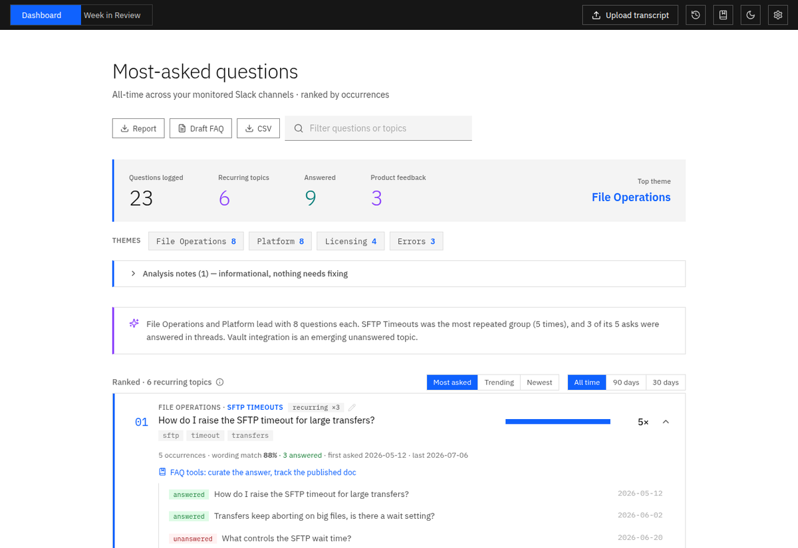
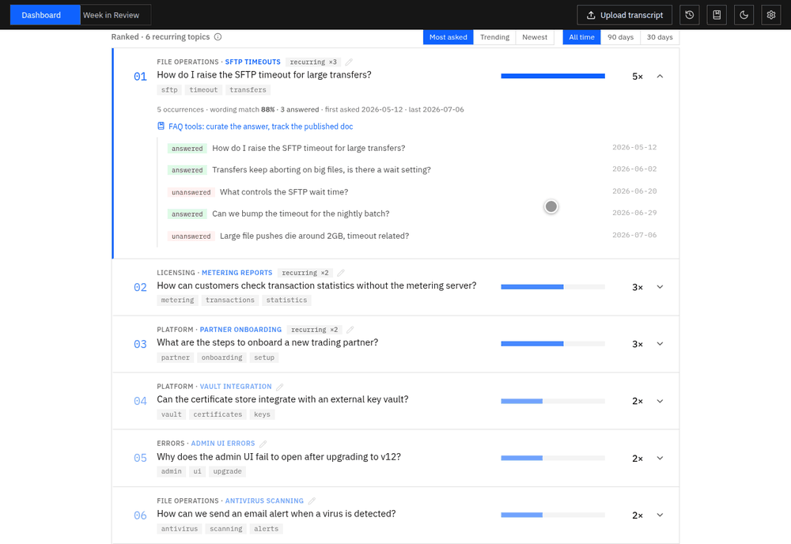
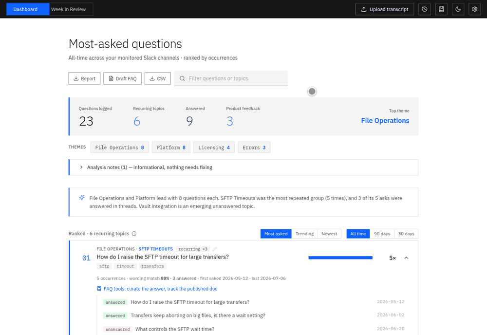
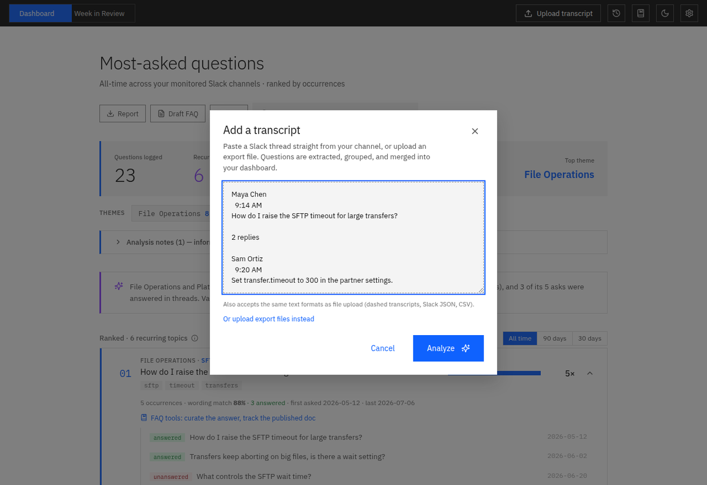
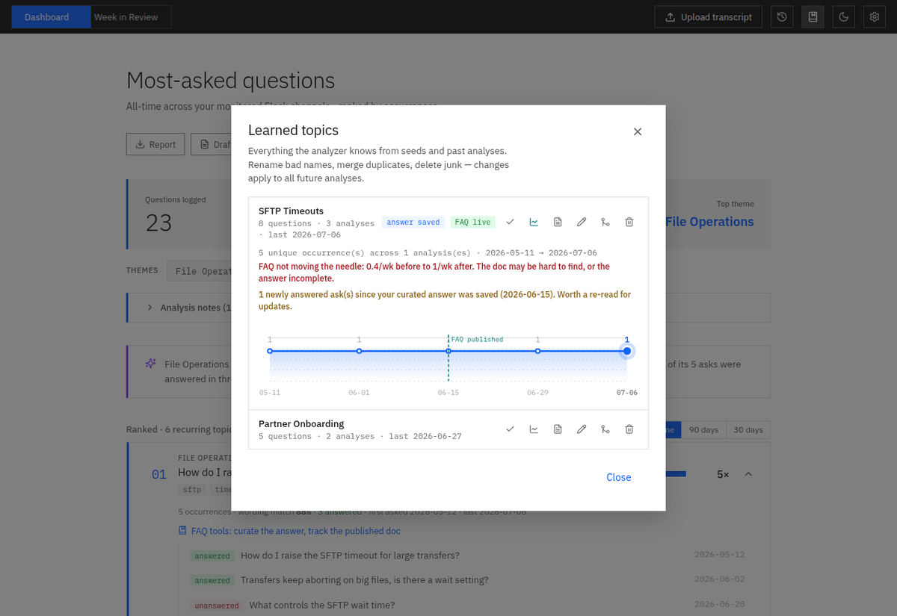
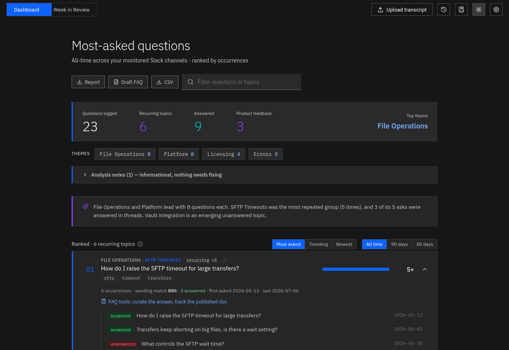

# Slack Question Analyzer

Turn a messy pile of Slack messages into a clear, ranked answer to one question: **"What do people keep asking us?"** It runs entirely on your own computer, for free, with nothing ever uploaded anywhere.

<p align="center">
  
</p>

## What is this?

If you run a support channel, the same questions arrive over and over, phrased fifty different ways, scattered across weeks, buried between answers and chit-chat. Reading it all by hand doesn't scale, and pasting customer conversations into a cloud AI is a privacy problem.

This tool does the reading for you, locally. Drop in a Slack transcript (a text dump, a Slack JSON export, a CSV, or a whole zipped export) and a few minutes later you get a dashboard showing:

- **The most-asked questions, ranked**: questions that mean the same thing are grouped together even when the wording is completely different, and every group gets a short AI-written name and summary (e.g. *"SFTP Timeout Settings: people keep asking how to raise the transfer timeout for large or slow transfers"*)
- **Which questions actually got answered** in threads, and which are still hanging
- **What's trending**: week-over-week volume, rising and falling topics, and a Week in Review view
- **Feature requests, separated out**: wish-list items are routed out of the support pile into their own list
- **A category breakdown** (themes) so you can see which product area generates the most confusion

Everything (the AI models, the analysis, the results) runs and stays on your machine via [Ollama](https://ollama.com). No API keys, no subscription, no cloud, no transcript ever leaving your computer.

**Built for non-technical users**: install is one double-click script, daily use is one double-click, updating is one double-click, and when anything is wrong the built-in `doctor` command tells you exactly what and how to fix it, in plain English.

## See it in action

**Expand any topic to see every real phrasing, each marked answered or unanswered:**



**Filter the whole dashboard by theme with one click:**



**Week in Review: click a dot on the trend, or step with the arrows, to replay any week:**


**Paste a Slack thread straight in, names and timestamps included, no export needed:**



**Every topic keeps its history across analyses, including your published FAQs:**



**Dark mode included:**



## Why you can trust what it tells you

Most AI tools ask you to take their output on faith. This one is built to be checked:

- **Measured accuracy, not promised accuracy.** The pipeline is graded against a suite of nine labeled fixtures (eight full transcripts plus one question-level set) with human-written answer keys. Every count, grouping, category, and answered-flag is checked automatically: **321 of 331 checks (97%)** at the most recent scored run, including a deliberately brutal fixture built from a raw real-world channel dump (announcements, double-posts, and rambling multi-part messages included). Every remaining miss is a documented judgment call, and the exam reruns on every change so accuracy can never silently regress.
- **Honest counts it can prove.** A topic can only display "asked 5×" if it can show you the 5 underlying questions from 5 distinct messages. Nothing is ever silently discarded: every duplicate or phantom removed during analysis appears in a "Removed during analysis" list with its reason and source message.
- **It admits what it doesn't know.** Questions that don't fit any known category land in a visible *needs review* pile instead of being forced into the nearest wrong bucket, and a recurring review pile is your signal that a new category is being born.
- **It learns your channel and takes correction.** A persistent topic bank remembers topics across analyses, so recurring topics keep stable names. Rename a topic once (pencil icon) and the fix sticks forever.

## Windows Quick Start: exact terminal commands

One-time prerequisite: install **[Ollama](https://ollama.com/download)** (run the
installer, that's it; it starts itself in the background).

Then open **PowerShell** and paste these three lines:

```powershell
git clone https://github.com/Ben-Jordan-IBM/slack-question-analyzer.git
cd slack-question-analyzer
.\setup.bat
```

`setup.bat` checks Python, installs the package, downloads the AI models
(~2GB on smaller machines, ~7GB with 12GB+ RAM; let it run), and opens the
dashboard in your browser at http://localhost:5000. That's the whole install.

**Every day after that**, it's just:

```powershell
cd slack-question-analyzer
.\start.bat
```

(or double-click `start.bat` in the folder, no terminal needed.)

**To get the latest version**, double-click `update.bat` (macOS/Linux:
`./update.sh`). It pulls the new code AND reinstalls dependencies, because a plain
`git pull` alone breaks the app whenever an update adds a dependency.

**If anything seems broken**, this prints exactly what's wrong and how to fix it:

```powershell
python -m slack_question_analyzer.cli doctor
```

macOS/Linux: same flow with `./setup.sh`; see [Quick Start](#quick-start-give-this-to-a-teammate) below.

## Features

### Understands questions, not just keywords

- **Smart extraction**: pulls the actual questions out of raw Slack dumps (plain
  text, Slack JSON exports, CSV, or text copied straight out of the Slack app,
  format auto-detected), strips Slack markup
  (mentions, links, emoji, code blocks), rewrites each question to stand on its
  own, and even catches implicit help requests that aren't phrased as questions
- **Ignores the noise**: webinar promos, sales announcements, win-wire posts,
  and "please note" notices are recognized and treated as context, never as
  question sources. A rhetorical "Why should customers care?" in a marketing
  post will never show up in your rankings, and skipped announcements are
  counted on the dashboard so nothing disappears silently
- **Groups by meaning, not wording**: "How do I raise the SFTP timeout?" and
  "transfers keep aborting on big files, is there a wait setting?" land in the
  same group. Under the hood: embeddings (numeric fingerprints of meaning)
  do the matching, cheap text comparison merges the obvious duplicates first,
  and a local AI model double-checks every borderline merge and audits every
  group it forms
- **Names everything**: each group gets a 2-4 word topic name and a one-sentence
  summary written by the AI, plus extracted keywords. You read *"Partner
  Onboarding Setup"*, not a wall of raw questions
- **Sorts questions into your categories**: a versioned, editable taxonomy
  (`taxonomy.json`) routes every group into product-area buckets, with an AI
  tie-breaker for ambiguous calls and an honest *needs review* pile for
  questions that fit nothing
- **Separates feature requests from support questions**: wish-phrasing
  ("would love it if…", "any plans to…") is detected and routed to its own
  product-feedback list
- **Knows what got answered**: thread replies are read and judged. A real
  answer marks the question answered; "let me check" does not
- **Tracks time**: every group shows when it was first and last asked, feeding
  trends, recency ranking, and the Week in Review

### Proves it's right

- **A replayable exam**: nine labeled fixtures with human answer keys grade
  the full pipeline on every change (321/331 checks, 97%, at the most recent scored run,
  including a raw field-run fixture graded strictly against a human answer
  key), with a scoreboard, saved baselines, and newly-failing diffs
  (`slack-analyzer eval`)
- **Honest, provable counts**: a group can only show a count it can back with
  real rows from distinct source messages
- **Full provenance**: every question any stage removed (duplicate, phantom,
  rephrasing) is listed on the dashboard with its reason and source. Nothing
  is ever silently consumed
- **Learns over time**: a persistent topic bank keeps recurring topics' names
  stable across analyses (with a "recurring ×N" badge that never double-counts
  overlapping re-uploads), starts pre-seeded with
  150 curated topics, and accepts corrections: rename once, fixed forever

### Private, free, and offline by design

- **100% local**: every part of the pipeline (embeddings, AI judgment calls,
  storage) runs on your machine via Ollama. No API keys, no cloud, no per-use
  cost, and no transcript ever leaves your computer
- **Even the dashboard is offline**: all JS libraries and fonts ship in the
  repo. No CDN, nothing phones home, works on locked-down corporate networks
- **Fast on repeat**: embeddings and AI outputs are cached on disk, so
  re-analyzing is near-instant; transient hiccups are retried automatically
- **Right-sized AI**: picks the chat model to fit your RAM (8B on ≥12GB
  machines, compact 3B otherwise), and when both are available, the big model
  makes the judgment calls while the small one does the typing

### Anyone can run it

- **One double-click each** for install (`setup.bat`/`setup.sh`), daily use
  (`start.bat`), and updates (`update.bat`/`update.sh`)
- **Self-diagnosing**: `slack-analyzer doctor` checks the entire chain (Python,
  models, Ollama, config) and prints the exact fix for anything wrong; missing
  models get a **Download now** button right in the dashboard
- **A dashboard that answers real questions**: sort by *Most asked*, *Trending*,
  or *Newest*; scope to the last 30/90 days of your data; filter by theme or
  search; dark mode; browse/reload/delete past analyses; manage learned topics
  (rename, merge, delete, and see each topic's volume over time across every
  analysis you have ever run); a "Still unanswered" backlog of questions
  nobody answered; export any analysis as a Markdown report or CSV
- **One-click draft FAQ that writes its own first draft**: top topics with
  every real phrasing, an AI-condensed answer built ONLY from your own
  thread replies (every fact is checked against them; drafts that invent
  anything are rejected and the raw replies are quoted instead), answered
  one-off questions as bonus entries, and a list of recurring topics still
  needing an answer
- **"Did my FAQ work?" tracking with a verdict**: mark a topic's FAQ as
  published and the topic-history chart shows a marker at that date, plus a
  plain-language verdict comparing weekly ask volume before and after the
  publish date ("working: asks fell 78%", "not moving the needle", or "too
  early to tell"), so you know which docs paid off and which need another
  look
- **Curated answers**: once you approve an answer's wording, save it on the
  topic in the learned bank. Every future FAQ export uses your approved
  answer instead of drafting a new one (even for analyses saved earlier),
  turning the export into a living FAQ document
- **Stale-answer nudge**: when a topic keeps getting newly answered asks
  after you saved its curated answer, the history panel and the FAQ export
  point it out, because those newer thread replies may contain fixes your
  saved answer lacks
- **Analyze several exports together**: drop multiple files into the upload
  window and they merge into one corpus
- **Paste a Slack thread directly**: copy a whole thread out of Slack (names
  and timestamps included) and paste it into the upload window. The first
  message becomes the question and the rest become its replies, so answer
  detection works on pasted threads too. Pasting dashed transcripts, Slack
  JSON, or CSV text works the same as uploading a file
- **Works in a half-width window**: the dashboard reflows for split-screen
  use on a laptop, with a keyboard-visible focus ring on every control
- **Week in Review**: weekly volume vs last week, a 6-week trend chart, and
  per-topic movement, all on real calendar weeks (Monday to Sunday). Click a
  point on the trend chart to review that week; click any topic to jump to
  its full history
- **Robust jobs**: analyses queue politely, can be cancelled mid-run, and
  survive server restarts (interrupted jobs resume automatically)
- **Automation-friendly**: a full CLI and a REST API alongside the dashboard,
  with JSON/CSV/Markdown output

## Quick Start (give this to a teammate)

Clone the repo, then run the setup for your platform. It checks Python, installs
everything, downloads the AI models, and opens the dashboard:

- **Windows:** double-click **`setup.bat`** (afterwards, `start.bat` starts the app)
- **macOS / Linux:** run **`./setup.sh`** (afterwards, double-click `start.command`
  on a Mac, or run `python3 api_server.py`)

The only manual prerequisite is [Ollama](https://ollama.com/download); if it isn't
installed, the script says so and where to get it. After setup, starting the app is
just `python api_server.py` (the browser opens automatically). If a model is missing,
the dashboard offers a **Download now** button, no terminal needed. And when something
seems off, `slack-analyzer doctor` checks the whole setup and prints exact fixes.

Prefer containers? `docker compose up -d` runs everything **including** the model
downloads. Then open http://localhost:5000.

**Tips for a smooth start:**
- Get the code with `git clone` rather than downloading a zip: Windows marks zip
  contents with a security flag that makes SmartScreen warn on the setup scripts
  (if you did use a zip: right-click each `.bat`/`.ps1` → Properties → Unblock).
- If port 5000 is taken (macOS reserves it for AirPlay), the server picks the next
  free port automatically and prints the URL.
- Set `DOMAIN_CONTEXT` in `.env` (e.g. `a webMethods MFT support Slack channel`);
  it's injected into every AI prompt and makes topic names noticeably sharper.

## Installation

### Prerequisites

- Python 3.10 or higher
- (Optional) Ollama installed locally for free embeddings
- (Alternative) Docker; see [Running with Docker](#running-with-docker)

### Setup

1. Clone or download this repository

2. Install the package (editable, with dev tools):
```bash
pip install -e ".[dev]"        # or: pip install -r requirements.txt (same thing)
```

This installs the `slack-analyzer` command.

3. Configure the analyzer (optional; the defaults work out of the box):
```bash
slack-analyzer setup
```

This writes a `.env` with your local Ollama settings.

### Running with Docker

The compose file runs the whole stack, the analyzer (API + dashboard) plus
Ollama, and pulls the default models (`nomic-embed-text` + `llama3.2`)
automatically on first start:

```bash
docker compose up -d --build
docker compose exec ollama ollama pull llama3.1:8b  # optional upgrade: better judgment calls (needs ~8GB RAM)
```

Then open http://localhost:5000. Analyses, the embedding cache, and Ollama models
persist in named volumes. To run just the analyzer container against an Ollama on
your host, `docker build -t slack-question-analyzer . && docker run -p 5000:5000
slack-question-analyzer` (it defaults to `host.docker.internal:11434`).

### Ollama Setup (Recommended)

For free, local processing:

1. Install Ollama from https://ollama.ai
2. Pull the embedding model:
```bash
ollama pull nomic-embed-text
```
3. Run the setup wizard and choose 'ollama'

## Usage

### Basic Analysis

Analyze one or more files containing Slack questions: plain files, several at
once, or a zipped Slack export (everything merges into a single corpus):

```bash
slack-analyzer analyze example_input.txt
slack-analyzer analyze slack-export.zip -o report.md
slack-analyzer analyze week1.json week2.json -o combined.md
```

### Save Results to JSON

```bash
slack-analyzer analyze example_input.txt -o results.json
```

### Adjust Similarity Threshold

Higher threshold = stricter grouping (0.0 to 1.0):

```bash
slack-analyzer analyze example_input.txt --threshold 0.9
```

**With the shipped taxonomy, grouping uses a fixed bar** (`IN_BUCKET_THRESHOLD`,
default 0.8) because LLM verification and auditing guard every borderline merge.
Without a `taxonomy.json`, the bar is adaptive instead: it starts at 0.85 and is
raised automatically above your corpus's measured noise level (the bulk of
pairwise similarities, p90 + `NOISE_GATE_MARGIN`). This matters because in a single-domain
channel, embedding models score even UNRELATED questions very high, so any fixed
threshold eventually sits inside that noise band and merges different topics. The
console logs the effective bar per run. If nothing groups and your most similar pair
clearly stands out from the bulk, the bar relaxes to just below it (never into the
noise); otherwise the analyzer honestly reports singletons instead of a blob. Setting `--threshold`, the Settings slider, or `SIMILARITY_THRESHOLD` pins an exact
value and disables auto-adjustment. Results always include pairwise similarity stats
(`metadata.similarity_stats`) for informed tuning.

### Choose an Output Format

The output format is inferred from the file extension:

```bash
slack-analyzer analyze example_input.txt -o results.json   # machine-readable
slack-analyzer analyze example_input.txt -o results.csv    # one row per question
slack-analyzer analyze example_input.txt -o report.md      # readable report
```

### Caching

Embeddings are cached in `.embedding_cache/` and LLM outputs (topic labels,
summaries, verdicts; deterministic at temperature 0) in `.llm_cache/`, one file per
provider/model. Re-analyzing the same transcript costs zero provider calls. To bypass:

```bash
slack-analyzer analyze example_input.txt --no-cache   # embeddings only
```

Env switches: `EMBEDDING_CACHE=off`, `LLM_CACHE=off`, `EMBEDDING_CACHE_DIR`,
`LLM_CACHE_DIR`.

### Validate Input File

Check if your input file is formatted correctly:

```bash
slack-analyzer validate example_input.txt
```

## Input Formats

The input format is detected automatically:

**Plain text** with dashed separators (see `example_input.txt`):

```
Date

Question or message text here...

-----------------------------------------------------------
Date

Another question or message...

-----------------------------------------------------------
```

**Slack JSON export**: a list of message objects (or `{"messages": [...]}`); Slack
epoch timestamps (`ts`) are converted to dates automatically:

```json
[
  {"type": "message", "user": "U123", "text": "How do I reset my password?", "ts": "1704412800.000100"}
]
```

**CSV** with a `text`/`message`/`question` column and an optional `date`/`ts`/`timestamp` column:

```csv
date,message
2024-01-05,How do I reset my password?
```

## LLM Features

"LLM" here means the local chat model (the same kind of AI as ChatGPT, but
running on your machine via Ollama). When one is available, the pipeline uses
it for a set of optional passes: extraction, verification/auditing, labeling,
answer detection, and summaries.
The default chat model is sized to your machine: `llama3.1:8b` (better topic names
and verification) on machines with 12GB+ RAM, `llama3.2` (3B, ~2GB) on smaller ones.
If only the small model is downloaded, the app quietly uses it. When both are
downloaded, the big model handles the short judgment calls (verification, group
audit, labels) and `llama3.2` does the token-heavy question extraction. Big
models judge, small models type. With Ollama:

```bash
ollama pull llama3.1:8b   # or llama3.2 on machines with less RAM
```

| Feature | What it does | Switch (in `.env`) |
|---|---|---|
| Topic labels | Names each group (2-4 words) and writes a one-sentence summary | `GROUP_LABELS` |
| Group verification | Double-checks group pairs whose similarity falls just below the threshold and merges them when they're the same topic | `LLM_VERIFY_GROUPS` |
| Question extraction | By default (`auto`), the LLM extracts and cleanly rewrites **every** question for transcripts up to 150 messages (best quality; regex fallback per batch); transcripts up to `EXTRACT_QUALITY_MAX` (30) messages use the **quality** model end-to-end; larger transcripts use regex plus an LLM pass for implicit help requests. `full` forces LLM-first at any size, `on` is regex-first only | `LLM_EXTRACTION` |
| Answer detection | Reads thread replies (Slack JSON exports) and decides whether each question was actually answered; feeds the "Answered" metric | `LLM_ANSWER_DETECTION` |
| Executive summary | 2-3 sentence overview of the dominant themes, shown on the dashboard and in Markdown reports | `EXECUTIVE_SUMMARY` |

Each switch accepts `auto` (default: run when the model is available), `on`, or `off`.
`GROUP_LABELS=off` (or `--no-labels` on the CLI) disables all LLM features at once.

```env
# Ollama chat model for all LLM features. Default is automatic:
# llama3.1:8b with >=12GB RAM, llama3.2 otherwise. Set to pin a model.
# OLLAMA_GENERATION_MODEL=llama3.1:8b

# Borderline verification window and call cap
LLM_VERIFY_MARGIN=0.03
LLM_VERIFY_MAX=10
```

Prompting details: all calls use chat endpoints with JSON-schema-enforced output,
temperature 0, a fixed seed, and `keep_alive` so Ollama keeps the model loaded across
calls. Labeling prompts include few-shot examples, the group's keywords, and a diverse
sample of phrasings; outputs are validated (generic topics like "General Questions" are
rejected) with one corrective retry. Everything degrades gracefully: without a
generation model, groups fall back to keyword-based topics and the analysis still works.

## Output Format

The tool generates a JSON file with the following structure:

```json
{
  "total_questions": 25,
  "total_groups": 8,
  "groups": [
    {
      "representative_question": "How do I configure antivirus scanning?",
      "questions": [...],
      "count": 5,
      "avg_similarity": 0.92,
      "keywords": ["antivirus", "scanning", "configure", "virus", "email"]
    }
  ],
  "ungrouped_questions": [...],
  "feature_requests": [...],
  "dropped_questions": [{"text": "...", "reason": "same-message rephrasing", "source": "..."}],
  "themes": [{"name": "Operations & Performance", "count": 9}],
  "threads_present": false,
  "answered_questions": 0,
  "executive_summary": "...",
  "metadata": {
    "analyzed_at": "2026-06-09T20:00:00+00:00",
    "similarity_threshold": 0.85,
    "model": "nomic-embed-text",
    "provider": "ollama",
    "app_version": "2.62.1",
    "prompt_pack": 26,
    "routing": {"taxonomy_version": 5, "routed": 12, "needs_review": 1},
    "llm_stats": {"verify_true": 2, "audit_evictions": 1}
  }
}
```

## Configuration

Create a `.env` file (or use the setup wizard):

```env
# Ollama Configuration (local & free, the only backend by design)
OLLAMA_URL=http://localhost:11434
OLLAMA_MODEL=nomic-embed-text

# Analysis Settings
SIMILARITY_THRESHOLD=0.85
```

## How It Works: the category funnel

*(This section is for the curious; you don't need any of it to use the app.)*

The pipeline is built so the language model is never asked to do the hard
open-ended thing (find categories in a pile of questions). Embeddings handle
similarity, plain code handles counting and merging, and the LLM only answers
small closed questions (sort one item, judge one group).

1. **Extraction**: the chat model extracts and rewrites every question to be
   self-contained (small transcripts use the quality model end-to-end; regex
   and a quality-model double-check act as safety nets). Deterministic
   invariants clean up after it: source-support, same-message rephrase
   collapse, the single-ask cap, and a hard rule that an enumerated split
   ("1. ... 2. ...") can never be re-merged
2. **Global grouping, meaning first**: ALL questions cluster together at a
   fixed bar (`IN_BUCKET_THRESHOLD`), so a recurrence can never be
   fragmented by category noise. The learned topic bank claims questions it
   recognizes; borderline merges get an LLM verify; every formed group gets
   a two-judge audit, with routing as the tie-breaking third judge
3. **Cluster routing** (`taxonomy.json`): each *cluster* goes to its nearest
   bucket anchor by embedding similarity. Top-2 anchors too close, or a weak
   best match → the quality model picks from a closed list (with an explicit
   "none of these" option). Unroutable clusters are held for **review** as a
   unit; a multi-question review cluster is the signal that a new category
   is being born
4. **Merge map**: each bucket collapses into its fixed `category` from
   `taxonomy.json` (the dashboard's themes strip), in deterministic code
5. **Ranking**: groups sort by frequency, then recency (most-recently-asked
   breaks ties; undated groups sort last); keywords are scored
   against the rest of the corpus. A group may only render a count it can
   prove with populated, distinct-source rows, and everything any stage
   removed is recorded in `dropped_questions` with its reason

The taxonomy is versioned data, not code: edit `taxonomy.json`, bump its
`version`, and every result records which taxonomy version classified it
(`metadata.routing`), along with routing health rates.

## Examples

### Example 1: Analyze with Ollama (Free)

```bash
# Make sure Ollama is running
ollama serve

# Run analysis
slack-analyzer analyze example_input.txt -o results.json
```

### Example 2: Strict Grouping

```bash
# Only group very similar questions (threshold 0.95)
slack-analyzer analyze example_input.txt --threshold 0.95
```

## Web Dashboard

A React dashboard (in `Question Analyzer Design System/ui_kits/analyzer/`) provides a visual
front end on top of the same analysis engine. The Flask server serves both the API **and**
the dashboard, so the whole app runs with one command.

### Running the Full Stack

1. **Start Ollama** (if not already running):
   ```bash
   ollama serve
   ```
2. **Start the server** (`start.bat` on Windows, or):
   ```bash
   python api_server.py
   ```
3. **Open the dashboard**: http://localhost:5000

Upload a transcript via the upload modal. The progress bar reflects real backend progress
(per-embedding), and completed analyses are saved to `analyses/`, and the dashboard
automatically reloads your most recent analysis after a page refresh.

Dashboard features:
- **Export buttons**: download the displayed analysis as a Markdown report or CSV
- **History** (clock icon): browse, reload, or delete any past analysis
- **Sort & scope** (above the ranked list): sort by Most asked, Trending
  (newest 30 days of data), or Newest, and scope to the last 30/90 days
  of your data or all time
- **Dark mode** (moon icon): remembered between visits
- **Learned topics** (book icon): browse, rename, merge, or delete the
  topics the bank has learned across analyses, and chart any topic's
  weekly volume across every saved analysis (overlap-safe: re-uploaded
  messages never double the curve)
- **Draft FAQ export**: top topics with real phrasings and the thread
  replies that answered them, plus the unanswered topics needing an owner
- **Still unanswered backlog**: every question with a thread where no
  reply actually answered, in its own section
- **Settings** (gear icon): choose the similarity threshold used for
  new analyses (persisted in the browser)
- **Week in Review**: real weekly trends computed from your latest analysis. Volume
  vs last week, 6-week trend, and per-topic rank movement (weeks are anchored to the
  most recent question date in the transcript, so historical exports work too)
- **Needs review & provenance**: questions the router honestly couldn't place
  get their own amber section; a collapsible "Removed during analysis" list
  shows every collapsed duplicate with its reason and source message
- **Answered chips**: when the transcript contains thread replies, answered
  questions and per-group answered counts are marked in green
- **Stale-results banner**: results saved by an older app version show an
  amber notice so you know to re-upload after updating
- Before your first analysis, both views show a clean backend-driven empty state
  with an upload prompt, never sample data

Analyses are queued one at a time by default so a local Ollama isn't overloaded
(`MAX_CONCURRENT_JOBS` to change), can be **cancelled** mid-run from the upload modal,
and **survive server restarts**: jobs are persisted under `jobs/` and anything that was
queued or running when the server stopped is automatically re-queued on startup.
Other server settings: `API_HOST` (default `127.0.0.1`), `API_PORT` (default `5000`),
`FLASK_DEBUG`, `MAX_CONTENT_MB` (default `50`), `ANALYSES_DIR` (default `analyses/`),
`JOBS_DIR` (default `jobs/`).

Uploads accept `.json`, `.txt`, `.csv`, or a **zipped Slack export**: every
`.json`/`.txt`/`.csv` file inside the zip (e.g. one JSON file per day) is merged and
analyzed as a single corpus.

Very large transcripts are handled too: above `LARGE_CLUSTERING_THRESHOLD` (default
2000) distinct questions, grouping switches to memory-safe leader clustering instead
of a full n×n similarity matrix, and the dashboard paginates long topic lists.

> **Security note:** the server has no authentication; it is meant to run on
> your own machine (CORS is restricted to localhost origins). Don't set
> `API_HOST=0.0.0.0` on a shared network.

### API Endpoints

| Endpoint | Method | Description |
|---|---|---|
| `/api/health` | GET | Health check; verifies the local Ollama backend and its models |
| `/api/analyze` | POST | Start an analysis job. JSON body `{"content": "...", "threshold": 0.85}` or multipart `files=` upload (`.json`/`.txt`/`.csv`/`.zip`). Returns `202` with `{"job_id": "..."}` |
| `/api/jobs/<job_id>` | GET | Job status (`queued`/`running`/`done`/`error`/`cancelled`) and progress; includes the full result when done |
| `/api/jobs/<job_id>/cancel` | POST | Cancel a queued or running job |
| `/api/analyses` | GET | List of saved past analyses (newest first) |
| `/api/analyses/latest` | GET | Full results of the most recent analysis |
| `/api/analyses/<id>` | GET | Full results of a specific analysis |
| `/api/analyses/<id>` | DELETE | Delete a saved analysis |
| `/api/analyses/<id>/export` | GET | Download as `?format=md`, `faq` (draft FAQ), `csv`, or `json` |
| `/api/analyses/latest/weekly` | GET | Week-in-Review stats; `?week=YYYY-MM-DD` reviews that calendar week |
| `/api/topics` | GET | The learned topic bank (topics accumulated across analyses) |
| `/api/topics/<topic_id>` | PATCH | Rename a learned topic (`{"topic": "New name"}`) |
| `/api/topics/<topic_id>` | DELETE | Delete a learned topic from the bank |
| `/api/topics/<topic_id>/merge` | POST | Merge this topic into another (`{"into": "<target id>"}`) |
| `/api/topics/<topic_id>/history` | GET | The topic's weekly volume across ALL saved analyses (overlap-safe) |
| `/api/topics/<topic_id>/published` | POST | Mark a topic's FAQ published (`{"published": true}`); the date becomes a chart marker and enables the effectiveness verdict |
| `/api/topics/<topic_id>/answer` | POST | Save a curated answer (`{"answer": "..."}`); FAQ exports use it instead of drafting. Empty string clears it |
| `/api/models/pull` | POST | Download a missing Ollama model (`{"model": "..."}`); progress at `GET /api/models/pull/<model>` |
| `/api/config` | GET | Current configuration (threshold, models, version) |

A finished job's `data` field contains the same JSON structure shown in
[Output Format](#output-format).

Example:
```bash
# Start a job
curl -X POST http://localhost:5000/api/analyze \
  -H "Content-Type: application/json" \
  -d '{"content": "2026-06-05\nHow do I configure virus scanning?"}'
# -> {"success": true, "job_id": "abc123..."}

# Poll for progress / result
curl http://localhost:5000/api/jobs/abc123...
# -> {"status": "running", "progress": {"stage": "embedding", "completed": 12, "total": 49}}
```

## Troubleshooting

### Ollama Connection Error ("connection refused")

Make sure Ollama is running:
```bash
ollama serve
```

### Model Not Found

Pull the required model (about 274MB, one time only):
```bash
ollama pull nomic-embed-text
```

### Port 11434 Already in Use

Run Ollama on another port and update `.env` to match:
```bash
OLLAMA_HOST=127.0.0.1:11435 ollama serve
```
```env
OLLAMA_URL=http://localhost:11435
```

### Alternative Ollama Models

Set `OLLAMA_MODEL` in `.env` (and `ollama pull` it first):
- `nomic-embed-text`: recommended (274MB)
- `all-minilm`: smaller and faster (45MB), less accurate
- `mxbai-embed-large`: larger (670MB), more accurate

### Import Errors

```bash
pip install -r requirements.txt
```

## Development

### Project Structure

```
slack-question-analyzer/
├── slack_question_analyzer/
│   ├── __init__.py
│   ├── __main__.py
│   ├── cli.py              # Command-line interface (the slack-analyzer command)
│   ├── analyzer.py         # Pipeline orchestration & invariants
│   ├── question_extractor.py  # Multi-format parsing & question detection
│   ├── similarity_analyzer.py # Embeddings, dedupe tiers & grouping
│   ├── group_labeler.py    # LLM prompting layer (all prompts live here)
│   ├── taxonomy.py         # Bucket routing (anchors, abstention)
│   ├── topic_bank.py       # Learned topics across analyses
│   ├── evaluation.py       # Regression harness (slack-analyzer eval)
│   ├── weekly_stats.py     # Week-in-Review computation
│   ├── inputs.py           # File/zip loading
│   ├── model_defaults.py   # RAM-aware model selection
│   ├── disk_cache.py       # JSON disk caches
│   ├── ollama_http.py      # Shared Ollama HTTP helper (retries, errors)
│   ├── textutil.py         # Shared text primitives (source cap, stems, dates)
│   └── exporters.py        # CSV / Markdown export
├── tests/                  # pytest suite (no Ollama needed)
├── fixtures/               # Labeled eval transcripts + answer keys
├── docs/media/             # README screenshots and GIFs
├── taxonomy.json           # Routing buckets (versioned data; see Your Data to customize)
├── seed_topics.json        # Curated topic names for the bank's first run
├── api_server.py           # Flask API + dashboard server
├── PIPELINE.md             # Full pipeline spec & design history
├── Question Analyzer Design System/  # React dashboard + design system
│   └── vendor/             # Vendored JS libraries + IBM Plex fonts (offline, no CDN)
├── setup.bat / setup.ps1 / setup.sh  # One-command install (both Windows; macOS+Linux)
├── start.bat / start.command         # Daily double-click launchers
├── update.bat              # Pull the latest version + reinstall deps
├── update.sh               # Same, for macOS/Linux
├── pyproject.toml          # Package metadata & dependencies
├── requirements.txt        # pip alias for the same install
├── Dockerfile / docker-compose.yml   # Container setup
├── .github/workflows/ci.yml          # Tests + lint on every push
├── example_input.txt       # Sample input file
├── .env.example            # Configuration template
├── LICENSE                 # MIT
└── README.md
```

### Running Tests

```bash
# Run the test suite (no Ollama required; embeddings are mocked)
python -m pytest tests/

# Manual smoke test
slack-analyzer validate example_input.txt
slack-analyzer analyze example_input.txt
```

### Regression Evaluation

Nine labeled fixtures (`fixtures/`, eight full transcripts plus one
question-level set) replay the pipeline against answer keys: exact counts, recurrence sizes, feedback
membership, routing abstentions, noise rejection, provenance. Run after ANY
prompt, anchor, or threshold change (requires Ollama with the models pulled):

```bash
slack-analyzer eval            # all fixtures; exits 1 on any miss
slack-analyzer eval fixtures/mft_synthetic_7.json   # just one

# Measure a change against the previous round instead of eyeballing:
slack-analyzer eval --json baseline.json          # save this round
slack-analyzer eval --compare baseline.json       # newly failing / newly passing
# LLM stability check (flaky checks are noise, not signal):
slack-analyzer eval --runs 3 --no-cache
```

Every run ends with a scoreboard: per-fixture pass counts with failing
checks broken down by axis (extraction, recurrence, over-merge, routing,
answered, feedback, integrity).

Each fixture's human-readable trap map lives next to it
(`fixtures/mft_test_answer_key*.md`). To freeze a new transcript into the
suite, copy an existing `mft_synthetic_*.json` and adjust its `expect` block.

## Your Data: what to back up, what's safe to delete

Everything lives in the project folder, git-ignored:

| Path | What it is | Safe to delete? |
|---|---|---|
| `topic_bank.json` | The learned topic memory: every rename you made, every recurring topic. **Back this up.** | Deleting resets all learning |
| `analyses/` | Every saved analysis (the History modal). | Deleting clears history |
| `.embedding_cache/`, `.llm_cache/` | Speed caches. | Yes; they rebuild themselves |
| `jobs/` | In-flight/finished job records (uploaded transcripts sit here in plaintext while a job runs). | Yes, when no analysis is running |
| `.env` | Your configuration. | Keep it |

**Do not "fix" a broken install by re-cloning into a fresh folder**: that silently leaves `topic_bank.json` and `analyses/` behind. Run `update.bat`
(or `git pull && pip install -e .`) in place instead.

**Always run the app and CLI from this folder**: `taxonomy.json`,
`seed_topics.json`, the topic bank, and `.env` are found relative to where
you launch from. Run from elsewhere and routing/seeds silently switch off
(`slack-analyzer doctor` warns about exactly this).

**Customizing the taxonomy or seeds:** `taxonomy.json` and `seed_topics.json`
are tracked by git, so editing them in place collides with future updates.
Copy them (e.g. `my_taxonomy.json`) and point `.env` at your copies with
`TAXONOMY_PATH=my_taxonomy.json` / `SEED_TOPICS_PATH=my_seeds.json`.
Note: seeds are only read when the topic bank is EMPTY (the very first
analysis); to re-seed after that, delete `topic_bank.json` first.

## License

MIT License

## Contributing

Contributions welcome! Please feel free to submit issues or pull requests.